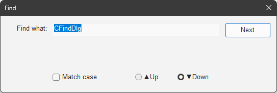
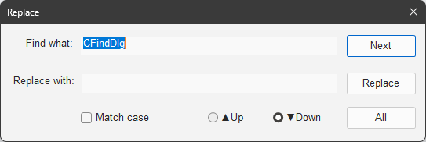

# `CFindDlg`

Implemented in [`FindDlg.h`](../../MemoPad/MemoPad/FindDlg.h) / [`FindDlg.cpp`](../../MemoPad/MemoPad/FindDlg.cpp)

This class shows 'the find & replace dialog' to find or replace the text in the current content.

Unlike the
[standard find & replace dialog in MFC](https://learn.microsoft.com/en-us/cpp/mfc/reference/cfindreplacedialog-class),
this dialog is drawn in '*darkened*' color.

This dialog is a modeless dialog to specify a text to search in the '*view*',
and the '*view*' [`CMemoView`](CMemoView.md)
is the ['owner'](https://learn.microsoft.com/en-us/cpp/mfc/reference/cwnd-class#setowner)
of this dialog, not the ['parent'](https://learn.microsoft.com/en-us/cpp/mfc/reference/cwnd-class#setparent).
So you can move this dialog out of the '*view*' like Notepad in Windows10 ( NOT like Notepad in Windows11 ).

This dialog is just a 'human interface' to specify a text and conditions.
Actual job to search ( and replace ) the text is
[done in the '*view*'](CMemoView.md#lresult-onfind-wparam-wparam-lparam-lparam-).

## Constructor

### `CFindDlg( void )`

The constructor

This function initializes the members in this class.

## Interface Functions

### `void ShowDialog( char chMode, CString strFind )`

Shows the dialog

Exported method 1 of 1

This function makes this dialog visible according to the given mode `chMode` as:

| `chMode`	| The mode			| Shown as	|
| ---:		| ---				| --		|
| `'f'`		| Dialog to find a text		|<picture><source media="(prefers-color-scheme: dark)" srcset="FindInTheDark.png"><source media="(prefers-color-scheme: light)" srcset="FindInTheLight.png"></picture>	|
| `'r'`		| Dialog to replace a text	|<picture><source media="(prefers-color-scheme: dark)" srcset="ReplaceInTheDark.png"><source media="(prefers-color-scheme: light)" srcset="ReplaceInTheLight.png"></picture>	|

The given text `strFind` is set as a text to find
and keyboard focus is set on it.

## Overridden Functions

### `BOOL OnInitDialog( void )`

Initializes the dialog

This method is to override the initialization of the
[`CDialog`](https://learn.microsoft.com/en-us/cpp/mfc/reference/cdialog-class)
class.

Overridden here to call
[`SupportDarkMode()`](CMainFrame.md#supportdarkmode-hwnd-)
to '*darken*' the dialog.

## Message Handlers

### `void OnShowWindow( BOOL bShow, UINT nStatus )`

Handles [`WM_SHOWWINDOW`](https://learn.microsoft.com/en-us/windows/win32/winmsg/wm-showwindow)
message to take action for when the dialog is shown ( or hidden )

According to the mode set by [`ShowDialog()`](#void-showdialog-char-chmode-cstring-strfind-),
this function shows/hides the controls as:

#### Mode `'f'` to find:

* Hides the controls for `Replace`
* Hides the `All` button

#### Mode `'r'` to Replace:

* Shows the controls for `Replace`
* Shows the `All` button

### `void OnSysCommand( void )`

Handles [`WM_SYSCOMMAND`](https://learn.microsoft.com/en-us/windows/win32/menurc/wm-syscommand)
message to handle `Close` in the system menu

When `Close` is selected in the system menu, this handler hides the dialog instead of closing the dialog,
since this is a modeless dialog.
No matter how rare the users close this dialog with the system menu are,
the program must respond to them.

### `void OnTimer( UINT_PTR nIDEvent )`

Handles [`WM_TIMER`](https://learn.microsoft.com/en-us/windows/win32/winmsg/wm-timer)
message to catch the expired timer

Following timer is used in this class:

| Timer		| Actions when expired					|
| ---		| ---							|
| `TID_CLICK`	| Invalidate 'clicked item' without clicked state	|

This makes the clicked button flickered once.

### `void OnClickButton( UINT uID )`

Handles [`WM_COMMAND`](https://learn.microsoft.com/en-us/windows/win32/menurc/wm-command)
message with `BN_CLICKED` in `WPARAM`
to take action for the clicked button

The action is to post a request to the '*view*' with the following steps:

1. Get the ID of clicked button ( since this handler is called by `ON_CONTROL_RANGE` macro )
1. Set timer `TID_CLICK` to restore the button color
1. Retrieve the flags of `Match case` and `UP` / `Down` from the controls on the dialog
1. Retrieve the text of `Find what` and `Replace with` from the controls on the dialog
1. If the `Replace with` matches with `Find what` except case, set `Match case`
1. Get the '*view*' and post a request to the '*view*'

No.5. is a little act of kindness from this function to the users
who want to change only upper/lower cases of the text but forgot to set case sensitive.
