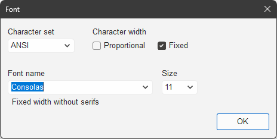

# `CFontDlg`

Implemented in [`FontDlg.h`](../../MemoPad/MemoPad/FontDlg.h) / [`FontDlg.cpp`](../../MemoPad/MemoPad/FontDlg.cpp)

This class shows 'the font dialog' to select a font to display the current content.

Unlike the
[standard font dialog in MFC](https://learn.microsoft.com/en-us/cpp/mfc/reference/cfontdialog-class),
this dialog is drawn in '*darkened*' color like below.

<picture>
<source media="(prefers-color-scheme: dark)" srcset="FontInTheDark.png">
<source media="(prefers-color-scheme: light)" srcset="FontInTheLight.png">

</picture>

This dialog is a modeless dialog to select a font to view the '*view*',
and the '*view*' [`CMemoView`](CMemoView.md)
is the ['owner'](https://learn.microsoft.com/en-us/cpp/mfc/reference/cwnd-class#setowner)
of this dialog, not the ['parent'](https://learn.microsoft.com/en-us/cpp/mfc/reference/cwnd-class#setparent).
So you can move this dialog out of the '*view*'.

This dialog differs from
the [standard font dialog in MFC](https://learn.microsoft.com/en-us/cpp/mfc/reference/cfontdialog-class)
in the usage as:

* At first, select a 'Character set' to narrow the list of fonts.
* Then, choose 'Character width' ( 'Proportional' or 'Fixed' ) to narrow the list of fonts.
* Finally, select a 'Font name' out of the narrowed list.

This 'narrow & select' usage is adopted because the selection in
the [standard font dialog in MFC](https://learn.microsoft.com/en-us/cpp/mfc/reference/cfontdialog-class)
shows too many font names.

## Constructor

### `CFontDlg( void )`

The constructor

This function initializes the members in this class.

## Overridden Functions

### `BOOL OnInitDialog( void )`

Initializes the dialog

This method is to override the initialization of the
[`CDialog`](https://learn.microsoft.com/en-us/cpp/mfc/reference/cdialog-class)
class.

Overridden here to insert the following procedures:

* Call [`SupportDarkMode()`](CMainFrame.md#supportdarkmode-hwnd-) to '*darken*' this dialog
* Call [`InitControls()`](#void-initcontrols-void-) to initialize controls on this dialog
* Call [`LoadSettings()`](#void-loadsettings-void-) to load settings from the registry and setup the controls

### `void OnOK( void )`

Acts on `OK` button

This method is to override the actions when the user clicks the `OK` button.

Overridden here to call [`SaveSettings()`](#void-savesettings-void-)
to save the current settings into the registry.

## Message Handlers

### `void OnShowWindow( BOOL bShow, UINT nStatus )`

Handles [`WM_SHOWWINDOW`](https://learn.microsoft.com/en-us/windows/win32/winmsg/wm-showwindow)
message to take action for when the dialog is shown ( or hidden )

The action is to set focus on the combobox for `Font name`.

### `void OnSysCommand( void )`

Handles [`WM_SYSCOMMAND`](https://learn.microsoft.com/en-us/windows/win32/menurc/wm-syscommand)
message to handle `Close` in the system menu

When `Close` is selected in the system menu, this handler hides the dialog instead of closing the dialog,
since this is a modeless dialog.
No matter how rare the users close this dialog with the system menu are,
the program must respond to them.

### `void OnSelectCharset( void )`

Handles [`WM_COMMAND`](https://learn.microsoft.com/en-us/windows/win32/menurc/wm-command)
message with `CBN_SELCHANGE` in `WPARAM`
to take action for the `Character set` selection

The action is to call [`EnumFontGroup()`](#void-enumfontgroup-void-)
to enumerate the fonts filtered by `Character set`.

### `void OnSelectName( void )`

Handles [`WM_COMMAND`](https://learn.microsoft.com/en-us/windows/win32/menurc/wm-command)
message with `CBN_SELCHANGE` in `WPARAM`
to take action for the `Font name` selection

The action is to call [`SeekFontByName()`](#void-seekfontbyname-void-)
to select the font specified by `Font name`.

### `void OnSelectSize( void )`

Handles [`WM_COMMAND`](https://learn.microsoft.com/en-us/windows/win32/menurc/wm-command)
message with `CBN_SELCHANGE` in `WPARAM`
to take action for the `Size` selection

The action is to call [`SelectFont()`](#void-selectfont-void-)
to set the font with specified size by `Size`.

### `void OnClickWidth( void )`

Handles [`WM_COMMAND`](https://learn.microsoft.com/en-us/windows/win32/menurc/wm-command)
message with `BN_CLICKED` in `WPARAM`
to take action for the `Character width` selection

The action is to call [`EnumFontGroup()`](#void-enumfontgroup-void-)
to enumerate the fonts filtered by `Character width`.

## Specific Functions

### `void InitControls( void )`

Initializes the control on the dialog

This function does the followings:

1. Fill the list of `Character set`
1. Fill the list of `Size`
1. Set focus on `Font name`

The size set in 2. is a 'point' size calculated with logical DPI ( dot per inch ) of '72'.
This value of '72' is selected for the compatibility with Notepad.exe, not the actual value on your monitor.

### `void LoadSettings( void )`

Loads the settings from registry

The values are in
`\HKEY_CURRENT_USER\Software\In-house Tool\MemoPad\Font\` of the registry.

If no values are set in the registry, default values are as follows:

| Value name	| Type		| Content		| Default value	|
| ---		| ---		| :---:			| ---:		|
| `"CharSet"`	| `REG_DWORD`	| Character set		| `0` ( ANSI )	|
| `"Pitch"`	| `REG_DWORD`	| Character width	| `1` ( Fixed )	|
| `"Point"`	| `REG_DWORD`	| Font size		| `11` [point]	|
| `"Name"`	| `REG_SZ`	| Font name		| `"Consolas"`	|

Loaded values are set to the each control on this dialog.

### `void SaveSettings( void )`

Saves the settings into registry

Only changed values are saved.
So, a value never changed from the default has no entry in the registry.
They say that writing so frequently this kind of non-volatile data is not good
for your ( NAND flash-based ) SSD.

### `void EnumFontGroup( void )`

Enumerates the fonts

The fonts are filtered by the `Character set` and `Character width`.
Enumerated fonts are put in the list of `Font name` to select by the name later.

### `void SeekFontByName( void )`

Selects a font by `Font name`

The font specified by `Font name` is select as the current font.

### `int EnumFontProc( const LOGFONT* plf, const TEXTMETRIC* ptm, DWORD dwType, LPARAM lparam )`

Callback handler of
[`EnumFontFamiliesEx()`](https://learn.microsoft.com/en-us/windows/win32/api/wingdi/nf-wingdi-enumfontfamiliesexw)

This function receives a pointer to
[`LOGFONT`](https://learn.microsoft.com/en-us/windows/win32/api/wingdi/ns-wingdi-logfontw)
of the enumerated font.

This is a static callback function, not a dynamically allocated class member method.
So, this function calls
[`OnEnumFont()`](#bool-onenumfont-const-logfont-plf-)
 via `LPARAM` which points the class instance.

### `BOOL OnEnumFont( const LOGFONT* plf )`

Handles one font out of enumerated fonts

This function is called from
[`EnumFontProc()`](#int-enumfontproc-const-logfont-plf-const-textmetric-ptm-dword-dwtype-lparam-lparam-)
( which is the callback handler of 
[`EnumFontFamiliesEx()`](https://learn.microsoft.com/en-us/windows/win32/api/wingdi/nf-wingdi-enumfontfamiliesexw) )
with a pointer to a
[`LOGFONT`](https://learn.microsoft.com/en-us/windows/win32/api/wingdi/ns-wingdi-logfontw) as an argument.

In this class,
[`EnumFontFamiliesEx()`](https://learn.microsoft.com/en-us/windows/win32/api/wingdi/nf-wingdi-enumfontfamiliesexw) )
is used for 2 purposes:

1. Enumerate the fonts to fill the list of `Font name`
1. Get a [`LOGFONT`](https://learn.microsoft.com/en-us/windows/win32/api/wingdi/ns-wingdi-logfontw)
of the font which has specified in `Font name`

This function handles the given
[`LOGFONT`](https://learn.microsoft.com/en-us/windows/win32/api/wingdi/ns-wingdi-logfontw)
for both purposes.

### `void SelectFont( void )`

Shows the properties of the selected font

This function is called when a font is selected for the following purposes:

1. Notify the selected font to the ['*view*'](CMemoView.md)
1. Draw the properties of the selected font

The notification is posted by `WM_FONT` message ( defined in this class ) to
[`CMemoView`](CMemoView.md), and the message is handled in
[`CMemoView::OnFont()`](CMemoView.md#lresult-onfont-wparam-wparam-lparam-lparam-)
to set the font of '*view*'.