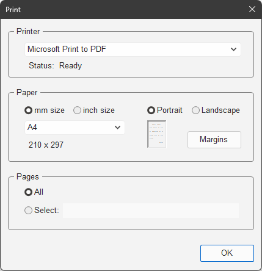
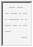
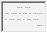
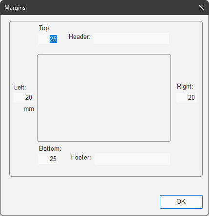

# `CPrintDlg`

Implemented in [`PrintDlg.h`](../../MemoPad/MemoPad/PrintDlg.h) / [`PrintDlg.cpp`](../../MemoPad/MemoPad/PrintDlg.cpp)

This class shows 'the print dialog' to print out the current content.

Unlike the
[standard print dialog in MFC](https://learn.microsoft.com/en-us/cpp/mfc/reference/cprintdialog-class),
this dialog is drawn in '*darkened*' color like below.

<picture>
<source media="(prefers-color-scheme: dark)" srcset="PrintInTheDark.png">
<source media="(prefers-color-scheme: light)" srcset="PrintInTheLight.png">

</picture>

This dialog is just a 'human interface' to specify how to print out.
Actual job to print the content is
[done in the '*view*'](CMemoView.md#bool-print-cprintparam-param-).

## Constructor

### `CPrintDlg( CWnd* pParent )`

The constructor

This function does nothing except the construction of a
[`CDialog`](https://learn.microsoft.com/en-us/cpp/mfc/reference/cdialog-class).

## Overridden Functions

### `BOOL OnInitDialog( void )`

Initializes the dialog

This method is to override the initialization of the
[`CDialog`](https://learn.microsoft.com/en-us/cpp/mfc/reference/cdialog-class)
class.

Overridden here to insert the following procedures:

1. Call [`SupportDarkMode()`](CMainFrame.md#supportdarkmode-hwnd-) to '*darken*' the dialog
1. Load the settings from registry
1. Call [`ListPrinters()`](#void-listprinters-void-) to fill the list of `Printer`
1. Select the default printer out of the list
1. Select `mm size` or `inch size`
1. Select the default paper size
1. Select `Portrait` or `Landscape`
1. Check `All` pages as default

The settings loaded at 2. are in
`\HKEY_CURRENT_USER\Software\In-house Tool\MemoPad\Print`
as follows:

| Value name	| Type		| Content			| Default value			|
| ---		| ---		| :---:				| ---:				|
| `"Printer"`	| `REG_SZ`	| Printer to output		| `"Microsoft Print to PDF"`	|
| `"Inch"`	| `REG_DWORD`	| `inch size` or not		| `0` ( `mm` )			|
| `"Size"`	| `REG_DWORD`	| Paper size			| `DMPAPER_A4`			|
| `"Landscape"`	| `REG_DWORD`	| `Landscape` or not		| `0`  ( `Portrait` )		|
| `"Header"`	| `REG_SZ`	| Header text			| ( empty )			|
| `"Footer"`	| `REG_SZ`	| Footer text			| ( empty )			|
| `"MarginL"`	| `REG_DWORD`	| Left margin			| `20` [mm]			|
| `"MarginR"`	| `REG_DWORD`	| Right margin			| `20` [mm]			|
| `"MarginT"`	| `REG_DWORD`	| Top margin			| `25` [mm]			|
| `"MarginB"`	| `REG_DWORD`	| Bottom margin			| `25` [mm]			|
| `"Tab"`	| `REG_DWORD`	| Tab count			| `8` [characters]		|

Note that there is no GUI to set tab count in this class. Use regedit if you insist on customizing the value.

### `BOOL OnOK( void )`

Acts on `OK` button

This method is to override the actions when the user clicks the `OK` button.

Overridden here to insert the following procedures:

1. If `Pages` is `Select:`, retrieve the text from the edit box and encode it by
[`GetPages()`](#bool-getpages-cstring-strpages-)
1. Retrieve the text from the `Printer` combo box and set it into the 'print parameter'
1. Set or clear 'inch' selector in the 'print parameter' according to `mm size` / `inch size` radio button
1. Set or clear 'landscape' selector in the 'print parameter' according to the `Portrait` / `Landscape` radio button
1. Save the changed settings into the registry

At 5., only changed values are saved.
So, a value never changed from the default has no entry in the registry.
They say that writing so frequently this kind of non-volatile data is not good
for your ( NAND flash-based ) SSD.

### `BOOL PreTranslateMessage( MSG* pMsg )`

Does specified procedures before window messages are dispatched

Overridden here to ignore the characters not concerned with page number entry.

## Message Handlers

### `void OnSelPrinters( void )`

Handles [`WM_COMMAND`](https://learn.microsoft.com/en-us/windows/win32/menurc/wm-command)
message with `CBN_SELCHANGE` in `WPARAM`
to take action for the `Printer` selection

The action is to set the status of the printer.

### `void OnRadioSize( UINT uID )`

Handles [`WM_COMMAND`](https://learn.microsoft.com/en-us/windows/win32/menurc/wm-command)
message with `BN_CLICKED` in `WPARAM`
to take action for `mm size` / `inch size` selection

The action is to set or clear
'inch' selector in the 'print parameter' according to `mm size` / `inch size` radio button.

### `void OnRadioOrientation( UINT uID )`

Handles [`WM_COMMAND`](https://learn.microsoft.com/en-us/windows/win32/menurc/wm-command)
message with `BN_CLICKED` in `WPARAM`
to take action for `Portrait` / `Landscape` selection

The action is to set or clear
'landscape' selector in the 'print parameter' according to `Portrait` / `Landscape` radio button.

### `void OnSelSize( void )`

Handles [`WM_COMMAND`](https://learn.microsoft.com/en-us/windows/win32/menurc/wm-command)
message with `CBN_SELCHANGE` in `WPARAM`
to take action for the paper size selection

The action is to call [`UpdatePaperSize()`](#void-updatepapersize-bool-bwhole-)
to replace the description under the combo box.

### `void OnClickMargins( void )`

Handles [`WM_COMMAND`](https://learn.microsoft.com/en-us/windows/win32/menurc/wm-command)
message with `BN_CLICKED` in `WPARAM`
to take action when `Margins` button is clicked

The action is to show [the margin dialog](#cmargindlg)
and get the settings.

### `void OnFocusPages( void )`

Handles [`WM_COMMAND`](https://learn.microsoft.com/en-us/windows/win32/menurc/wm-command)
message with `EN_SETFOCUS` in `WPARAM`
to take action when `Select:` edit box get focus

The action is to check `Select:` and uncheck `All`
as a little act of kindness to the users who want to specify pages but forgot to check `Select:`.

## Specific Functions

### `void ListPrinters( void )`

Makes a list of printers

This function enumerates the printers and put them into the list of `Printer`.

The enumeration is done in
[`EnumPrinters()`](https://learn.microsoft.com/en-us/windows/win32/printdocs/enumprinters)
for local printers.

### `void UpdatePaperSize( bool bWhole )`

Updates the list of paper size

If the argument `bWhole` is true,
this function renews the whole of the list of paper size. 
If the argument `bWhole` is false,
this function renews the explanation text of paper size.

### `void UpdateOrientation( void )`

Updates the orientation 'icon'

The 'icon' is an image below the radio button of `Portrait`.
This function updates the shape of 'icon' taller for `Portrait` or broader for `Landscape` as below.

| Portrait	| Landscape	|
| :---:		| :---:		|
| <picture><source media="(prefers-color-scheme: dark)" srcset="PortraitInTheDark.png"><source media="(prefers-color-scheme: light)" srcset="PortraitInTheLight.png"></picture>|<picture><source media="(prefers-color-scheme: dark)" srcset="LandscapeInTheDark.png"><source media="(prefers-color-scheme: light)" srcset="LandscapeInTheLight.png"></picture>|

Technically, this is not an icon but a frame drawn by
[static control](https://learn.microsoft.com/en-us/cpp/mfc/reference/cstatic-class).
This function sets position of this static control and replaces the 'dots' in it.

### `bool GetPages( CString strPages )`

Gets the selected pages

This function gets the pages specified in `Select:` edit box,
encode them into integers and set them into the 'print parameter'.

The text is encoded like below:

| Text		| Integers		|
| ---		| ---			|
| `"2 3 5 7"`	| `2` `3` `5` `7`	|
| `"1,2, 4,6"`	| `1` `2` `4` `6`	|
| `"2 - 6"`	| `2` `0` `6`		|

This function returns false, if the encoding was failed.

These integers are read by
[`CMemoeView::IsPageToPrint()`](CMemoView.md#bool-ispagetoprint-uint-upage-cuintarray-uapages-).

# `CMarginDlg`

Implemented in [`MarginDlg.h`](../../MemoPad/MemoPad/MarginDlg.h) / [`MarginDlg.cpp`](../../MemoPad/MemoPad/MarginDlg.cpp)

This class shows 'the margin dialog'.

This dialog is shown like below as a modal dialog to set the margins.

<picture>
<source media="(prefers-color-scheme: dark)" srcset="MarginInTheDark.png">
<source media="(prefers-color-scheme: light)" srcset="MarginInTheLight.png">

</picture>

The purpose of this dialog is to make each parameter easier to grasp visually.

## Constructor

This function does nothing except the construction of a
[`CDialog`](https://learn.microsoft.com/en-us/cpp/mfc/reference/cdialog-class).

## Overridden Functions

### `BOOL OnInitDialog( void )`

Initializes the dialog

This method is to override the initialization of the
[`CDialog`](https://learn.microsoft.com/en-us/cpp/mfc/reference/cdialog-class)
class.

Overridden here to insert the following procedures:

1. Call [`SupportDarkMode()`](CMainFrame.md#supportdarkmode-hwnd-) to '*darken*' the dialog
1. Set the text of the header in the 'print parameter' into the `Header` edit box
1. Set the text of the footer in the 'print parameter' into the `Footer` edit box
1. Set the margin values in the 'print parameter' into each edit box

### `BOOL OnOK( void )`

Acts on `OK` button

This method is to override the actions when the user clicks the `OK` button.

Overridden here to insert the following procedures:

1. Retrieve the text from the `Header` edit box and set it into the 'print parameter'
1. Retrieve the text from the `Footer` edit box and set it into the 'print parameter'
1. Retrieve the text from the edit box of each margin value and set it into the 'print parameter'

### `BOOL PreTranslateMessage( MSG* pMsg )`

Does specified procedures before window messages are dispatched

Overridden here to ignore the characters not concerned with margin entry.

This function does nothing for `Header` and `Footer` edit boxes,
for other edit boxes ( to enter the figures ) ignore the characters other than `0` &#x301c; `9` and `.`.

## Specific Functions

### `int GetValue( UINT uID )`

Gets the value of [mm]

This function gets the value from the edit box with given control.
Unit of the value is [mm].

### `void SetValue( UINT uID, int nValue )`

Sets the value of [mm]

This function sets the value into the edit box with given control.
Unit of the value is [mm].
