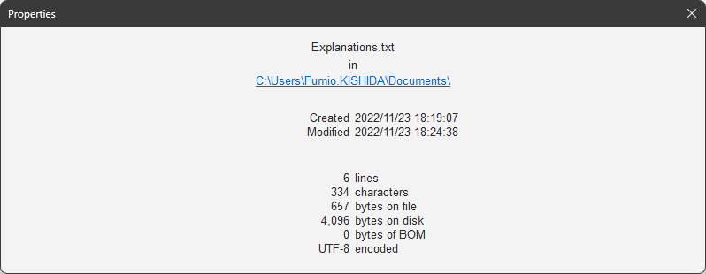

# `CPropertyDlg`

Implemented in [`PropertyDlg.h`](../../MemoPad/MemoPad/PropertyDlg.h) / [`PropertyDlg.cpp`](../../MemoPad/MemoPad/PropertyDlg.cpp)

This class shows 'the file property dialog' to show the properties of the current file.

This dialog is a modal dialog to show the properties of the file.

## Constructor

### `CPropertyDlg( CWnd* pParent )`

The constructor

This function initializes the members in this class.

## Interface Functions

### `void SetFile( CString strFile )`

Presets the name of the file

Exported method 1 of 3

This function is called to preset the name of the file.

The given file name is a full path of a file,
separated file name and its path, shown like below:

<picture><source media="(prefers-color-scheme: dark)" srcset="PropertyInTheDark.png"><source media="(prefers-color-scheme: light)" srcset="PropertyInTheLight.png"></picture>

The file path is shown as a 'link', Explorer opens the path when the link was clicked.
The size of the dialog is as wide as the '*view*' to be able to show a long file name.

### `void SetText( CString strLines )`

Presets the description of properties

Exported method 2 of 3

This function is called to preset the text describes the properties of the file.

The given text is a mulit-line string with the lines terminated by '\r\n'.
See [`CMemoView::OnFileProperties()`](CMemoView.md#void-onfileproperties-void-).

### `void SetModified( bool bModified )`

Presets whether the file is modified

Exported method 3 of 3

This function is called to preset whether the file is modified ( but not saved yet ).

If the file is modified,

* The text `"Modified"` is shown in red.
* The characters and bytes are based on the size of modified content ( not based on the file size ).

## Overridden Functions

### `BOOL OnInitDialog( void )`

Initializes the dialog

This method is to override the initialization of the
[`CDialog`](https://learn.microsoft.com/en-us/cpp/mfc/reference/cdialog-class)
class.

Overridden here to show preset properties, to call
[`SupportDarkMode()`](CMainFrame.md#supportdarkmode-hwnd-)
to '*darken*' the dialog,
and to resize this dialog to fit the width of the '*view*'.

## Message Handlers

### `void OnSetCursor( CWnd* pWnd, UINT nHitTest, UINT message )`

Handles [`WM_SETCURSOR`](https://learn.microsoft.com/en-us/windows/win32/menurc/wm-setcursor)
message to take action for mouse cursor

The action is to change the cursor shape by the position as

| Cursor position	| Cursor shape	|
| ---			| :---:		|
| On the 'file path'	| 	|
| Others		| 	|

to appeal to the user that the 'file path' is a 'link' to click.

### `void OnSize( UINT nType, int cx, int cy )`

Handles [`WM_SIZE`](https://learn.microsoft.com/en-us/windows/win32/winmsg/wm-size)
message to take action for resize

The action is to replace the controls according to the size.

This dialog is resized by the [`OnInitDialog()`](#bool-oninitdialog-void-) to fit the width of the '*view*'.

### `void OnClickPath( void )`

Handles [`WM_COMMAND`](https://learn.microsoft.com/en-us/windows/win32/menurc/wm-command)
message with `STN_CLICKED` in `WPARAM`
to take action for the clicked 'file path'

The action is to open the path with Explorer.

### `LRESULT OnCtlColorStatic( WPARAM wParam, LPARAM lParam )`

Handles [`WM_CTLCOLORSTATIC`](https://learn.microsoft.com/en-us/windows/win32/controls/wm-ctlcolorstatic)
message to take action for the colors of text

The action is as follows:

* Set the color of the text `"Modified"` red when the content is modified
* Set the color of 'file path' blue to appeal it is a 'link'

## Specific Functions

### `CSize GetValueSize( UINT uID )`

Gets the size of control

This function is called from [`OnSize()`](#void-onsize-uint-ntype-int-cx-int-cy-),
returns the pixel size of the given 'value' control.

### `CPoint GetUnitPoint( UINT uID )`

Gets the position of control

This function is called from [`OnSize()`](#void-onsize-uint-ntype-int-cx-int-cy-),
returns the pixel position of the given 'unit' control.
